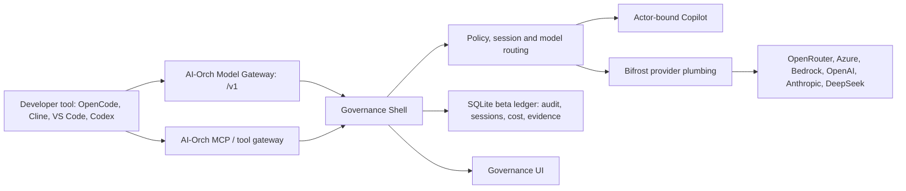

# AI Agent Orchestration POC

AI-Orch is a proof of concept for governing AI-assisted engineering work without forcing every team into one coding agent, IDE, model provider or workflow.

The bet is simple: teams will keep using OpenCode, Cline, Copilot, Claude Code, Codex, Cursor, VS Code, CI and future agent tools. The useful product is a small, strict control plane at the model, tool, patch and evidence boundary so the organisation can answer: who ran the work, why, through which model, with which permissions, at what cost, and with what audit evidence?

## What this is

AI-Orch is trying to provide approved model routing, actor-bound runtime credentials, policy gates, MCP/tool boundaries, session/cost/evidence records, and a local Governance UI for beta inspection.

The agent catalogue exists, but the agent plane is not the product. The product idea is the governance boundary around agentic engineering work.

## Current status

Current version: v0.21.2-beta.

This is a working local/team beta, not a production deployment. The strongest current client path is AI-Orch-routed OpenCode: OpenCode keeps local repo access, while model traffic, routing, token use, cost and session lifecycle cross AI-Orch.

Important caveat: AI-Orch currently sees OpenCode model calls and model-emitted tool-call names, but it does not automatically see the full local OpenCode Task/Read/Edit/Bash transcript. That needs ACP, MCP or deliberate client-event forwarding.

For the release-by-release capability inventory, see [changelog.md](changelog.md).

## How it fits together



Developer tools keep repository access and local editing; AI-Orch owns governance, routing, runtime credentials, audit, cost and evidence. For the deeper design, see [docs/architecture.md](ai-agent-orch/docs/architecture.md).

## Quick start

From `ai-agent-orch/`:

```sh
./scripts/beta-verify.sh
```

For a CIO/demo walkthrough that leaves the UI running:

```sh
./scripts/cio-demo-verify.sh
```

Open the Governance UI URL printed by the script, usually `http://127.0.0.1:18081/ui/`. The full runbook lives in [docs/deployment.md](ai-agent-orch/docs/deployment.md).

## Developer workflow

For a central team beta, developers should not need to run the AI-Orch Docker stack. They enrol once against the central Governance URL and then use OpenCode normally through the AI-Orch model gateway. The setup installs two governed OpenCode provider blocks (`ai-orch` for chat models, `ai-orch-responses` for Copilot's Responses-API-only GPT-5.x reasoning models) plus a headers-only git-context plugin, and preserves existing providers such as Moonshot, DeepSeek, OpenRouter and Copilot Zen. Git remote/branch/commit are captured client-side and a conversation reuses one governed session. Generated model metadata advertises image attachment support for governed models so developers can paste screenshots into direct `opencode` sessions; local operator restarts via `scripts/local-copilot-compose-up.sh` refresh existing OpenCode configs automatically.

See [docs/deployment.md](ai-agent-orch/docs/deployment.md) for enrolment and refresh commands, and [docs/runtime-client-integration.md](ai-agent-orch/docs/runtime-client-integration.md) for OpenCode, Cline, Copilot, Claude Code, Codex and workbench-style client boundaries.

## What this is not

AI-Orch is not trying to become:

- a replacement for OpenCode, Cline, Copilot, Cursor, Claude Code, Codex or Aider;
- a central source-code access service that browses every developer repository;
- a generic model gateway competing with Bifrost, OpenRouter, LiteLLM or provider-native gateways;
- an enterprise identity, secrets or device-management product;
- a production deployment template yet.

It should stay small, boring and strict at the boundary.

## Documentation

- [Deployment and local run guide](ai-agent-orch/docs/deployment.md): run, verify, enrol developers, recover local services and operate demos.
- [Architecture](ai-agent-orch/docs/architecture.md): north star, component boundaries, data flow, readiness and open design questions.
- [API contract](ai-agent-orch/docs/api-contract-v1.md): frozen beta API surface for integrators.
- [Runtime client integration](ai-agent-orch/docs/runtime-client-integration.md): client boundaries without centralising repo access.
- [Model compatibility gateway](ai-agent-orch/docs/model-compatibility-gateway.md): OpenAI-compatible gateway contract and remaining provider work.
- [Copilot integration](ai-agent-orch/docs/copilot.md): per-user GitHub Copilot routing, model aliases, chat vs Responses endpoints, and reasoning effort.
- [State and reporting direction](ai-agent-orch/docs/local-state-lifecycle.md) / [governance insight](ai-agent-orch/docs/governance-insight-and-memory.md): what is durable today and what must harden next.
- Component guides: [agents](ai-agent-orch/agents/README.md), [models](ai-agent-orch/models/README.md), [MCP](ai-agent-orch/mcp/README.md), [policies](ai-agent-orch/policies/README.md).
- [Production backlog](ai-agent-orch/docs/production-backlog.md): known hardening work before V1/production.
- [Changelog](changelog.md): versioned change history.

## License

This project is licensed under the Apache License 2.0.

If you use, copy, modify, distribute, or build on this work, retain the attribution in [NOTICE](NOTICE) or otherwise provide clear credit to the project author.
