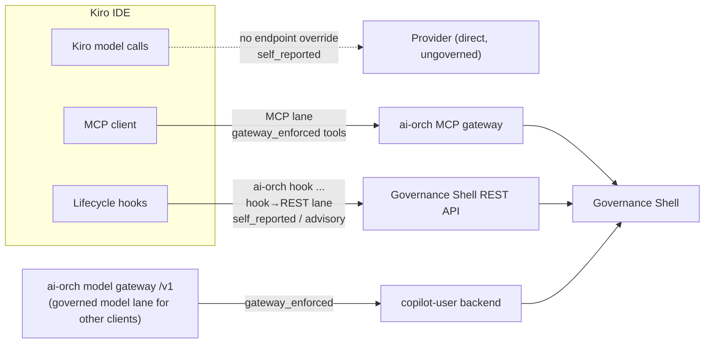
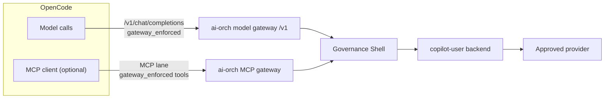
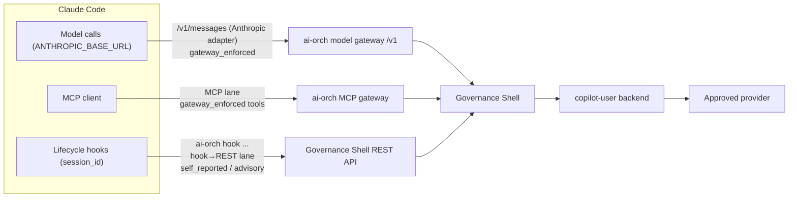

# Runtime Client Integration Strategy

## Summary

The strongest integration lane is not to make ai-orch browse every developer repository. The stronger lane is to make ai-orch the governed provider endpoint and tool gateway that existing coding agents are configured to use.

In practical terms:

```text
Developer tool
  OpenCode / Cline / VS Code Copilot / Claude Code / Codex / workbench
    -> keeps local repository access
    -> calls ai-orch for model access where supported
    -> uses ACP-native file and terminal permissions where supported
    -> calls ai-orch-mcp only for MCP-native tool integrations
    -> reports evidence, patch metadata and decisions back to ai-orch
```

The Governance Shell does not need the source tree. It needs session identity, model traffic, tool/evidence events, policy decisions, hashes, cost, usage and patch-decision records.

This keeps the system scalable across many developers because code execution stays close to the developer workspace, CI workspace or approved sandbox. The central system governs the boundary instead of becoming a central source-code access service.

## Status As Of v0.21.2-beta

AI-Orch-routed OpenCode is the strongest current client path. It works for the model
gateway lane: model route, provider/backend attribution, streaming, token usage, cost,
session lifecycle, and patch/diff evidence. It also records model-emitted tool-call
names and delegated child-session lineage when OpenCode asks for a `task` tool.

The remaining observability gap is the full local OpenCode Task/Read/Edit/Bash
transcript. ai-orch does not automatically see that transcript unless those actions
cross ACP hooks, the MCP gateway, or a deliberate sanitized client-event forwarding path.
Cline and other OpenAI-compatible clients remain plausible routes, but they are less
proven than OpenCode in the current beta.

Two further lanes are now implemented and broaden client coverage beyond OpenCode:

- **Claude Code model traffic is `gateway_enforced`.** The Anthropic-compatible adapter
  (`POST /v1/messages`) is built, so Claude Code pointed at `ANTHROPIC_BASE_URL` routes
  model calls through ai-orch with real usage and cost, the same as the chat lane.
- **Kiro and Claude Code have a generated hook→REST evidence lane.** `ai-orch mcp
  install --client kiro` generates lifecycle hooks that post to the Governance Shell
  REST API as `self_reported`/advisory evidence via `ai-orch hook
  prompt-submit|post-tool|stop`. This captures git context and lifecycle outcomes for
  clients whose model traffic does not cross the gateway.

Single-command developer onboarding wires these lanes per client:

- **`ai-orch developer enroll --client claude-code`** requests a runtime credential,
  generates the project Claude Code config (`CLAUDE.md`, `.mcp.json`,
  `.claude/settings.json` hooks), then backs up and merges the developer's Claude
  `settings.json` — setting `ANTHROPIC_BASE_URL` to the model gateway,
  `ANTHROPIC_AUTH_TOKEN` to the runtime credential, plus the MCP server block and
  lifecycle hooks. The adapter also onboards Claude Code's agentic tool use: it does
  full bidirectional tool-call translation (Anthropic `tool_use`/`tool_result` ↔ OpenAI
  `tool_calls`) on both the non-streaming and streaming `/v1/messages` paths, so tool
  turns route through the gateway end to end.
- **`ai-orch developer enroll --client kiro`** is governance-only: it requests a runtime
  credential, generates the Kiro MCP/steering/hooks config, and wires the credential
  into the Kiro MCP `env` as `AI_ORCH_DEV_TOKEN`. It sets no `ANTHROPIC_BASE_URL` and no
  model endpoint override, because Kiro has no governed model proxy lane — only the MCP
  tool lane and the hook→REST evidence lane.

### Managed-Client Runtime Credential

For a managed-client test connection such as T3Code/Neokod, mint an actor-bound
credential against the local Governance Shell and paste the `air_` value into the
client's governance settings:

```sh
cd ai-agent-orch
AI_ORCH_ACTOR_SUBJECT=<same-actor-used-for-Copilot> \
AI_ORCH_RUNTIME_CREDENTIAL_CLIENT=neokod \
scripts/dev-mint-runtime-credential.sh
```

The helper prints only the credential to stdout, so it can be command-substituted. If
the actor is not enrolled, it starts the existing GitHub device-login flow before minting.
For a non-default stack, set `AI_ORCH_GOVERNANCE_URL`, `AI_ORCH_DEV_TOKEN`, and optionally
`AI_ORCH_RUNTIME_CREDENTIAL_DEVICE_NAME`.

## Source Check

Checked on 2026-06-04:

- OpenCode supports custom/OpenAI-compatible providers through its provider config and `@ai-sdk/openai-compatible` style adapters. Its config supports provider/model settings and a custom config path via `OPENCODE_CONFIG`: https://dev.opencode.ai/docs/providers/ and https://dev.opencode.ai/docs/config
- OpenCode ACP is available through `opencode acp` for editor/runtime integration: https://opencode.ai/docs/acp/
- Cline supports an OpenAI-compatible provider with custom base URL, API key and model ID. The CLI also exposes `cline auth -p openai ... -b <baseurl>`: https://docs.cline.bot/provider-config/openai-compatible and https://docs.cline.bot/cline-cli/getting-started
- Cline supports MCP server configuration through `mcpServers`: https://docs.cline.bot/mcp/configuring-mcp-servers
- VS Code stores MCP server configuration in `mcp.json`, either at workspace or user scope: https://code.visualstudio.com/docs/copilot/reference/mcp-configuration and https://code.visualstudio.com/docs/copilot/customization/mcp-servers
- GitHub Copilot repository agents can use repository MCP configuration and can adapt VS Code MCP config: https://docs.github.com/en/copilot/how-tos/copilot-on-github/customize-copilot/configure-mcp-servers
- Claude Code supports MCP and can connect to external tools through MCP: https://code.claude.com/docs/en/mcp
- Claude Code supports `ANTHROPIC_BASE_URL` to route Claude API calls through a proxy or gateway: https://code.claude.com/docs/en/env-vars
- Codex supports MCP server configuration through the Codex CLI / config path, including `codex mcp add`: https://platform.openai.com/docs/docs-mcp
- T3 Code is a minimal workbench for coding agents, currently centred on existing Codex and Claude CLI flows rather than being a governance plane itself: https://github.com/pingdotgg/t3code
- Bifrost is open-source provider plumbing with OpenAI-compatible multi-provider routing across OpenAI, Anthropic, Bedrock, Vertex, OpenRouter and others: https://github.com/maximhq/bifrost

Checked on 2026-06-25:

- Claude Code exposes deterministic lifecycle hooks (SessionStart, UserPromptSubmit/PromptSubmit, PreToolUse, PostToolUse, PreCompact, Stop) configured in `.claude/settings.json`. Hooks run as shell commands that the model does not decide to invoke, receive a JSON event object on stdin (tool name and arguments for PreToolUse, tool response for PostToolUse), and are passed a stable `session_id` plus a `transcript_path`. Source: https://hidekazu-konishi.com/entry/claude_code_hooks_complete_guide.html and https://vineetagarwal-code-claude-code.mintlify.app/guides/hooks (content rephrased for compliance with licensing restrictions).
- Kiro exposes a comparable IDE hook system (`.kiro/hooks`) and MCP config at `.kiro/settings/mcp.json` using the `mcpServers` shape; it has no documented custom model-endpoint override.

## Boundary

The boundary is:

```text
Local client owns repo access.
ai-orch owns governance.
Bifrost or per-user Copilot owns provider plumbing behind ai-orch.
```

Do not build:

```text
one central OpenCode daemon with access to every developer repo
```

Build:

```text
managed provider endpoint + MCP/tool gateway + evidence API
```

This means the model router remains mandatory for governed work. The correction is only that the router should not also become the central repo runtime.

## Client Compatibility Matrix

| Client | Model gateway path | MCP/tool path | Notes |
| --- | --- | --- | --- |
| OpenCode | Strong fit through ACP plus a custom OpenAI-compatible provider pointing at ai-orch `/v1`. | MCP is optional and should stay on the MCP route, not injected through ACP. | Best first E2E target because it can run locally against a real repo while model calls route through ai-orch and file edits are captured as ACP workspace diff evidence. |
| Cline | Strong fit through OpenAI-compatible provider base URL. | Strong fit through Cline MCP server config. | Good second E2E target once OpenCode proves the gateway shape. |
| VS Code / Copilot | MCP fit through `.vscode/mcp.json` or user-scope `mcp.json`. Model endpoint control depends on Copilot/enterprise policy surface. | Strong MCP fit in VS Code. | Primary managed-client adoption lane where settings can be pushed centrally. |
| GitHub Copilot repository agents | MCP fit through repository MCP configuration. | Strong for delivery-time tools and evidence. | Better for issue/PR/check evidence than local IDE supervision. |
| Kiro | No documented custom model-endpoint override, so Kiro's own model traffic stays `self_reported` and cannot be `gateway_enforced`. | Strong MCP fit through `.kiro/settings/mcp.json` (same `mcpServers` shape as Claude Code), plus a generated hook-based REST lane. | IDE client, now supported by `ai-orch mcp install --client kiro`, which generates the MCP config, an `ai-orch.md` steering file, and three `.kiro/hooks/*.kiro.hook.json` lifecycle hooks. The hooks post to the Governance Shell REST API as `self_reported` evidence via `ai-orch hook prompt-submit\|post-tool\|stop`; see Hook-Based Client Integration below. |
| Claude Code | Anthropic-compatible path through `ANTHROPIC_BASE_URL`; the ai-orch `/v1/messages` adapter is implemented, so Claude Code model traffic is now `gateway_enforced` with real usage and cost. | Strong MCP fit, plus native deterministic lifecycle hooks. | `ai-orch mcp install --client claude-code` generates the MCP config; model routing goes through the Anthropic adapter; hooks receive a stable `session_id`, so session correlation is free. |
| Codex | MCP and instruction-file lane first. | MCP fit through Codex MCP config. | Model-endpoint routing depends on the Codex surface being used; do not over-claim until tested. |
| T3-style workbench | Depends on the underlying agent runtime. | Can call ai-orch APIs and MCP gateway directly if adapted. | Useful workbench reference, not the governance authority. |

## Hook-Based Client Integration (Kiro and Claude Code)

Some IDE clients cannot repoint their model traffic at the ai-orch `/v1` gateway but
do expose a deterministic lifecycle-hook system. Kiro (`.kiro/hooks`) and Claude Code
(`.claude/settings.json` hooks) both fire shell commands at fixed points in the
agent loop, independent of model discretion. This makes a hook-based evidence lane
viable without MCP.

This lane is implemented. `ai-orch mcp install --client kiro` generates the three
Kiro hook configs (`.kiro/hooks/ai-orch-prompt-submit.kiro.hook.json`,
`ai-orch-post-tool.kiro.hook.json`, `ai-orch-stop.kiro.hook.json`) alongside the MCP
config and steering file. Each hook invokes an `ai-orch hook prompt-submit|post-tool|stop`
subcommand that reads the lifecycle event JSON on stdin, gathers git context, and posts
directly to the Governance Shell REST API as `self_reported`/advisory evidence.

### The finding: hooks should hit the REST API directly, not MCP

The governed MCP tools (`start_governed_session`, `delegate_governed_work`,
`record_patch_decision`, `lookup_audit`, `record_external_tool_call`, ...) are thin
wrappers over the Governance Shell REST API. For example, `record_external_tool_call`
only reshapes its arguments and `POST`s to `/v1/evidence` with
`trust_level: self_reported`. A hook that calls the same REST endpoint directly is
byte-for-byte equivalent, minus the MCP process and the JSON-RPC `initialize`
handshake.

Therefore:

- **Do not route hooks through MCP.** `hook -> MCP -> REST` is strictly more layers
  than `hook -> REST` for identical effect and identical trust level. It is technically
  possible (the HTTP transport at `/mcp/v1/messages` returns a direct JSON-RPC response
  for non-SSE callers), but it adds no governance value because the tools just forward
  to REST.
- **Pick one owner of the governed session.** Mixing agent-driven MCP session creation
  with hook-driven evidence reintroduces a correlation gap: hooks run as separate
  one-shot processes and cannot see the `session_id` an MCP tool returned to the agent.
  Choose either:
  - *Hooks own the session* (recommended for deterministic capture): the
    prompt-submit hook creates/persists the governed session id and later hooks reuse
    it. On Kiro this means persisting the id (e.g. `.kiro/.ai-orch-session`) because
    Kiro hooks are stateless one-shot commands. On Claude Code the hook payload already
    carries a stable `session_id`, so no persistence is needed.
  - *Agent owns the session*: the agent calls `start_governed_session` over MCP and
    threads `session_id` through subsequent tool calls. One governed session works
    cleanly here because `session_id` is an explicit, required argument on every
    governed tool — the gateway process holds no implicit "current session".

### Implemented lifecycle mapping

| Hook event | Governance Shell call | Purpose |
| --- | --- | --- |
| prompt submit (`ai-orch hook prompt-submit`) | `POST /v1/sessions` | open or continue one governed session; attach git context headers |
| post-tool write/edit (`ai-orch hook post-tool`) | `POST /v1/evidence` or `POST /v1/sessions/{id}/patch-decision` | record that edits occurred |
| agent stop (`ai-orch hook stop`) | `POST /v1/evidence` + `GET /v1/audit/sessions/{id}` | self-report outcome and verify the trail |

Auth is the standard `Authorization: Bearer $AI_ORCH_DEV_TOKEN`. This whole lane is the
"deliberate sanitized client-event forwarding path" referenced elsewhere in these docs;
it lands as `self_reported`/advisory, not `gateway_enforced`, because the model call
never crosses ai-orch.

### What hooks can and cannot capture

- **Git context: easy.** Hooks run shell commands in the workspace, so they can read
  `git rev-parse --abbrev-ref HEAD`, `git config --get remote.origin.url` and
  `git rev-parse HEAD` and send them as `X-AI-Orch-Branch` / `X-AI-Orch-Repo-URL` /
  `X-AI-Orch-Commit-SHA`. This mirrors the OpenCode client-side context resolver.
- **Token usage: not capturable from hooks alone.** Token and cost accounting is a
  model-gateway property emitted by `/v1/chat/completions`; it exists only because the
  call crossed ai-orch. A client whose model traffic stays local has no usage data for a
  hook to forward, and a fabricated estimate is worse than nothing. For such clients,
  accurate usage requires routing model calls through the gateway.

### Kiro vs Claude Code

Both fit the hook-based REST lane, but Claude Code is the stronger candidate:

- **Session correlation.** Claude Code passes a stable `session_id` (and a
  `transcript_path`) to every hook, so events stitch into one governed session for free.
  Kiro hooks are stateless and must persist their own id between fires.
- **Model routing / token usage.** Claude Code supports `ANTHROPIC_BASE_URL`, and the
  Anthropic-compatible ai-orch adapter (`POST /v1/messages`) is now implemented, so its
  model traffic is `gateway_enforced` with real usage and cost — closing the exact gap
  that a hooks-only client cannot. The adapter also translates tool calls in both
  directions on the non-streaming and streaming paths, so Claude Code's agentic tool
  loops are onboarded through the gateway too. Kiro has no documented model-endpoint
  override, so its own model traffic stays `self_reported`/`managed_client` regardless of
  hooks vs MCP, and `ai-orch developer enroll --client kiro` deliberately configures no
  model proxy lane.
- **MCP parity.** Both register the stdio gateway the same way (`mcpServers` block
  launching `ai-orch mcp start --transport stdio`); `ai-orch mcp install --client
  claude-code` and `ai-orch mcp install --client kiro` both generate this.

## Client Flow Diagrams

Each diagram shows the three governance lanes and the trust level each one carries: the
model gateway lane (`gateway_enforced`), the MCP/tool lane (`gateway_enforced` tools),
and the hook→REST lane (`self_reported`/advisory). The presence or absence of a lane is
what differs between clients.

### Copilot → Kiro

Kiro governs through the MCP lane and the hook→REST lane. It has no model-endpoint
override, so its own model traffic does not cross the ai-orch model gateway and stays
`self_reported`. The governed model lane (model gateway → `copilot-user` backend) still
exists, but for other clients, not for Kiro's own calls.



### Copilot → OpenCode

OpenCode repoints its model calls at the ai-orch `/v1` gateway, so the model lane is
`gateway_enforced` end to end through the `copilot-user` backend. MCP is an optional
governed tool lane. The hook lane is not applicable.



### Claude Code

Claude Code uses all three lanes. Its model traffic routes through the Anthropic adapter
(`/v1/messages`), so it is `gateway_enforced` with real usage and cost; MCP carries
governed tools; and lifecycle hooks self-report evidence. The stable payload
`session_id` correlates events across all three lanes into one governed session.



The `session_id` Claude Code passes to every hook (and threads through the model and MCP
lanes) is what stitches the three lanes into a single governed session in audit.

## Enforcement Levels

| Level | What ai-orch knows | Trust label |
| --- | --- | --- |
| Model gateway | Model request crossed ai-orch; alias, provider, usage, cost and hashes are enforceable. | `gateway_enforced` |
| ACP runtime | OpenCode ran under ACP; model calls crossed ai-orch; file writes are captured through ACP write hooks or before/after workspace diff evidence. | `gateway_enforced` for model calls and durable runtime/patch events |
| MCP/tool gateway | Tool call crossed ai-orch MCP route; tool policy, auth and response metadata are enforceable. | `gateway_enforced` |
| Managed client | The client is configured by managed policy and reports local events. | `managed_client` |
| Self-report | The client reports native activity that did not cross a gateway. | `self_reported` |

The model gateway is necessary but not sufficient. It proves model routing and model usage. Local file edits are proven through ACP write events or workspace diff evidence. MCP remains separate and is only proof for tools that explicitly cross the MCP gateway.

These labels are observed facts, not access-control settings. ai-orch should not decide that a developer may or may not use Cline, OpenCode, Codex or another client because of a trust label. It should record how the work was run and make the evidence strength visible in audit and reporting.

## Metadata Without Token Waste

Governance metadata should not be stuffed into the model context window.

Prefer headers and compact IDs:

```text
X-AI-Orch-Session-ID
X-AI-Orch-Client-Session-ID
X-AI-Orch-Run-ID
X-AI-Orch-Agent
X-AI-Orch-Use-Case-ID
X-AI-Orch-Workflow-ID
X-AI-Orch-Client
X-AI-Orch-Trust-Level
X-AI-Orch-Enforcement-Mode
X-AI-Orch-Repo-URL
X-AI-Orch-Branch
X-AI-Orch-Commit-SHA
```

The client headers are hints. The Shell must derive the final `trust_level` and `enforcement_mode`; unknown clients remain `self_reported/advisory` and external native evidence remains self-reported even if a caller claims a stronger label.

The Shell should resolve use-case records, workflow rules, context manifests, policy, cost posture, cache eligibility and evidence expectations server-side.

The prompt should carry only the task, bounded working context and references the runtime actually needs.

## Git Context and Session Continuity

Git context (remote URL, branch, commit) is captured client-side, where the runtime actually runs, not by a server-side resolver. A server resolver would only see the Governance Shell container filesystem, never the developer's checkout. Two client paths supply it:

- The `ai-orch opencode` wrapper detects local git via `internal/contextresolver` and attaches `repo_url`/`branch`/`commit_sha` when it pre-creates the session.
- For developers who run `opencode` directly, the shipped OpenCode plugin (`cmd/ai-orch/assets/opencode-ai-orch-context.ts`, installed by `ai-orch opencode refresh`) detects git in the checkout and sends the three git headers plus `X-AI-Orch-Client-Session-ID` on the `ai-orch` and `ai-orch-responses` providers. The plugin is headers-only and does not mutate the model transcript: OpenCode validates message part ids and synthetic parts, so editing the conversation from a plugin is fragile. Agent awareness of the repo is left to the agent itself (specialists can run `git`), not to prompt injection.

Session continuity is owned by the gateway. When a request carries `X-AI-Orch-Client-Session-ID` (the runtime's own conversation id) and no `X-AI-Orch-Session-ID`, the gateway reuses one governed session per `(actor + client session id)` instead of minting a new session per model call. The git context is recorded once at that session's creation, and the session stays open across the conversation rather than being finished per request. Reuse is bounded to a recent window (12h) so a stale or abandoned conversation id cannot bind new traffic to old context; past the window a fresh session is created. The Shell strips any credentials from the remote URL before storing it, and the audit ledger records `repo_url`/`branch`/`commit_sha` on the `session.created`/`session.auto_created` event.

OpenCode is configured with two governed providers, because Copilot serves different model families on different API surfaces:

- `ai-orch` uses `@ai-sdk/openai-compatible` (`/v1/chat/completions`) for the chat-capable models (Claude, Gemini, gpt-5-mini).
- `ai-orch-responses` uses `@ai-sdk/openai` (`/v1/responses`) for the Responses-API-only models (gpt-5.3-codex, gpt-5.4-mini, gpt-5.5).

Generated model entries include OpenCode image attachment metadata (`attachment: true` and `modalities.input` containing `image`) so direct `opencode` sessions can paste screenshots into governed models instead of being blocked client-side. Developers should not need to run `ai-orch opencode` as a wrapper; after enrollment they can run `opencode` normally. Local Copilot stack restarts through `scripts/local-copilot-compose-up.sh` refresh existing global/project OpenCode configs automatically. Developers connecting to deployed QA/prod/shared gateways use `scripts/deployed-opencode-enroll.sh`, which installs a user-level refresh job for ongoing metadata updates.

## OpenCode E2E Current Posture

The first end-to-end runtime target is still local OpenCode, not a central hosted
runtime. The beta now proves the provider-endpoint lane; the remaining work is stronger
local tool transcript capture.

Current target flow:

```text
start governed run
  -> create session/runtime token
  -> generate temporary OpenCode config pointing at ai-orch model gateway
  -> start OpenCode through ACP in the local workspace
  -> run OpenCode inside a real local repo, disposable local worktree or Docker sandbox volume
  -> verify model calls reach ai-orch, not the upstream provider
  -> capture ACP file-write events or before/after workspace diff metadata
  -> submit patch metadata/content through the patch buffer path
  -> record patch decision
  -> confirm audit contains model usage, trust labels, tool/evidence events and no provider keys
```

Use `/Users/kamogelo/Code/ado_scripts` as a realistic local repo target, but run the first write test against a disposable worktree, the `opencode-sandbox-workspace` Docker volume, or a deliberately temporary file so existing work is not disturbed.

The E2E story has two evidence levels:

1. **Read-only model-routing proof.** This is the strongest current path: OpenCode runs
   a non-mutating review or explanation prompt and ai-orch audit sees the model call,
   provider route, usage, cost and session lifecycle.
2. **Patch proof.** OpenCode changes a disposable file or worktree and ai-orch records
   patch/diff metadata and the human decision path. This is useful evidence, but it is
   still not the same as a complete local Task/Read/Edit/Bash transcript.

This proves the useful organisational shape: developers keep their existing working
style, while model traffic and evidence cross ai-orch. Full local tool transcript
evidence needs ACP, MCP or client-event forwarding.
